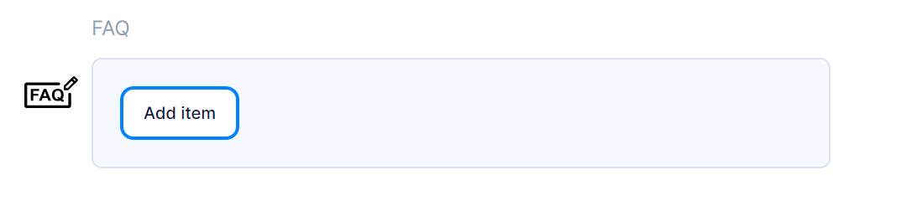
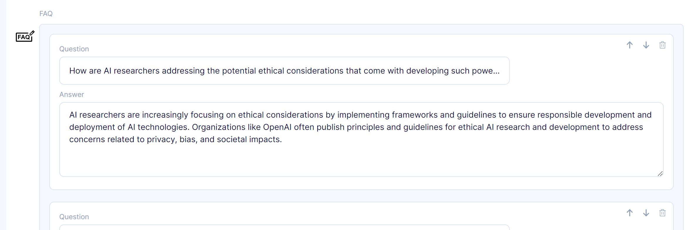
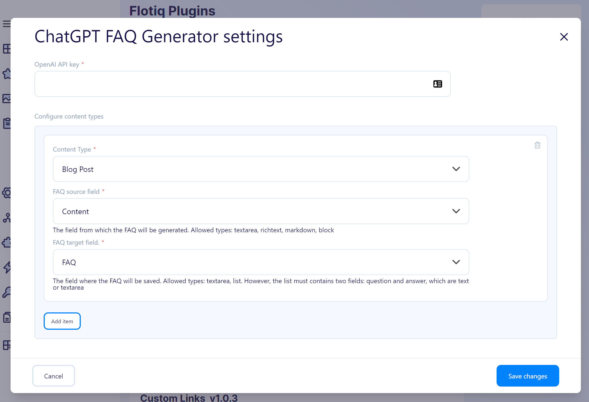

[[_TOC_]]

# ChatGPT FAQ Generator Plugin Documentation

## Overview
The ChatGPT FAQ Generator plugin automates the creation of FAQs from your content, streamlining the process of generating and saving FAQs to your desired field.

## Usage

1. Open the FAQ Generator settings modal.
2. Enter your OpenAI API key in the provided field.
3. Configure the content types and source/target fields according to your content structure.
4. Click 'Save changes' to apply the settings.
5. Go to object in one of the selected content types.
6. Locate the target field and click the FAQ icon on the left.
    

7. Once new FAQ is generated, save the content object.
    

## Configuration



### OpenAI API Key
Insert your OpenAI API key here. It should begin with `sk-...`.

### Content Types
Select the type of content you want to generate FAQs from.

### FAQ Source Field
Choose the field from which the FAQ will be generated. Supported types include:
- Textarea
- Richtext
- Markdown
- Block

### FAQ Target Field
Specify the field where the FAQ will be saved. Supported types are:
- Textarea
- List - must contain two fields: 
   - question (text or textarea)
   - answer (text or textarea)

## Development

### Quick start

1. `yarn` - to install dependencies
2. `yarn start` - to start development mode - rebuild on file modifications
3. update your `plugin-manifest.json` file to contain the production URL and other plugin information
4. `yarn build` - to build plugins

### Dev environment

Dev environment is configured to use:

* `prettier` - best used with automatic format on save in IDE
* `eslint` - it is built into both `start` and `build` commands

### Output

The plugins are built into a single `dist/index.js` file. The manifest is copied to `dist/plugin-manifest.json` file.

### Deployment

<!-- TO DO -->

### Loading the plugin

**Warning:** While developing, you can use  `https://localhost:3053/plugin-manifest.json` address to load the plugin manifest. Make sure your browser trusts the local certificate on the latter, to be able to use it e.g. with `https://editor.flotiq.com`

#### URL

**Hint**: You can use localhost url from development mode `https://localhost:3053/index.js`

1. Open Flotiq editor
2. Open Chrome Dev console
3. Execute the following script
   ```javascript
   FlotiqPlugins.loadPlugin('plugin-id', '<URL TO COMPILED JS>')
   ```
4. Navigate to the view that is modified by the plugin

#### Directly

1. Open Flotiq editor
2. Open Chrome Dev console
3. Paste the content of `dist/index.js` 
4. Navigate to the view that is modified by the plugin

#### Deployment

**Hint**: You can use localhost url from development mode `https://localhost:3053/plugin-manifest.json`

1. Open Flotiq editor
2. Add a new plugin and paste the URL to the hosted `plugin-manifest.json` file
3. Navigate to the view that is modified by the plugin
